# MAXIM APPLY
# Career-Ops Fork Implementation Roadmap
## Version 1.1 - Systems Architecture Second Pass
Prepared for Xavier Kubancik | 2026

Mission: implement Maxim Apply as a controlled Career-Ops fork that preserves Career-Ops as the job-search engine and adds Xavier-specific orchestration, integrated dashboard controls, networking shortlist workflows, recruiter tracking, Discord accountability, historical analytics, append-only auditability, and interview-rate optimization.

This roadmap supersedes v1.0 where it clarifies primitive ownership, module boundaries, patch zones, storage interfaces, dashboard seams, event logging, and risk mitigation. It remains aligned with the approved Maxim Apply v2.1 project description.

## Document Map

- Part 1 defines implementation authority, doctrine, and build strategy.
- Part 2 defines primitives, data contracts, repository layout, and patch boundaries.
- Part 3 defines feature-by-feature implementation requirements and low-level models.
- Part 4 defines interface contracts, sequence diagrams, and state models.
- Part 5 defines testing, risk mitigation, phases, Copilot/Codex backlog, and definition of done.

# Part 1 - Implementation Authority and Strategy

## 1. Executive Implementation Decision

Maxim Apply will be implemented as a limited Career-Ops fork. The fork must not become a rewrite. Career-Ops remains responsible for job evaluation, 1.0-5.0 scoring, tailored PDF generation, portal scanning, application-answer drafting, report generation, tracker artifacts, and the native dashboard. Maxim Apply adds a small set of extension modules that use Career-Ops output to orchestrate Xavier's job search.

The dashboard is the center of the product. Maxim controls must live inside the existing Career-Ops dashboard through a mode, tab, or keybinding. There will be no separate web CRM in v1.

## 2. Implementation Authority

| Priority | Authority | Meaning |
|---:|---|---|
| 1 | Latest confirmed user instruction | Most recent approved design choices. |
| 2 | Maxim Apply Project Description v2.1 | Current system-level authority. |
| 3 | This roadmap v1.1 | Current build authority. |
| 4 | Career-Ops upstream behavior/data contract | Preserve unless intentionally extended. |
| 5 | Job Search Command Center v1.1 | Requirements library for mission, analytics, guardrails, preferences. |
| 6 | 50-question answers and later corrections | Binding configuration rules. |
| 7 | Senior Systems Architecture Consultant principles | Primitive-first, black-box, low-cognitive-load architecture. |
| 8 | Greenfield roadmap v0.3 | Historical source only. |

## 3. Implementation Doctrine

| Principle | Build Rule |
|---|---|
| Build foundation first | Fork baseline, authority docs, config, storage, sync, tier router, dashboard seam before advanced workflows. |
| Patch surgically | Prefer new `maxim/` and `dashboard/internal/maxim/` packages. Keep direct edits to upstream files minimal. |
| Preserve native Career-Ops | Existing commands, dashboard, tracker, scanner, PDF generation, and apply assistant must continue to work. |
| Interface before implementation | Define DTOs and store interfaces before screens or feature logic. |
| No direct external dependencies | Wrap filesystem, SQLite, Discord, Gmail, LinkedIn research, AI providers, and Career-Ops artifacts behind adapters. |
| One developer per module | Each module must be small enough for one developer to understand and own. |
| Event everything important | Meaningful system actions and user decisions append to event log. |
| Safety by construction | There is no LinkedIn message sender and no application auto-submit in v1. |

## 4. Core Architecture

```text
+--------------------------------------------------------------------------------+
|                         Career-Ops Fork Root                                    |
+--------------------------------------------------------------------------------+
| Native Career-Ops                                                               |
|  modes/*, scan.mjs, generate-pdf.mjs, tracker scripts, reports/, output/, data/ |
|  Native Go dashboard: pipeline, filters, previews, status controls              |
+--------------------------------------------------------------------------------+
| Maxim Extension Layer                                                           |
|  maxim/lib, maxim/scripts, maxim/db, maxim/tests                                |
|  sync adapter, tier router, policy engine, networking, notifications, analytics |
+--------------------------------------------------------------------------------+
| Maxim Dashboard Mode                                                            |
|  dashboard/internal/maxim                                                       |
|  Today, High Conviction, Networking, Recruiter Inbox, Applications, Analytics   |
+--------------------------------------------------------------------------------+
| Local Data                                                                      |
|  Career-Ops user files + Career-Ops artifacts + data/maxim/maxim.db             |
|  data/maxim/events/*.jsonl append-only event log                                |
+--------------------------------------------------------------------------------+
```

# Part 2 - Primitives, Data Ownership, and Repository Strategy

## 5. Core Primitives and Owners

| Primitive | Owner Module | Stored In | Notes |
|---|---|---|---|
| CareerOpsArtifact | CareerOpsAdapter | reports/output/data paths | Link and parse, never rewrite unless through native tool. |
| CareerOpsEvaluation | Sync Adapter | SQLite + source report | Parsed report, score, company, role, report path, PDF path. |
| MaximJob | Orchestration | SQLite | Job with tier, flags, next action, status. |
| MaximTier | Tier Router | computed + stored | T0/T1/T2/T3 with connection overlay. |
| PriorityFlag | Policy Engine | SQLite | Fresh, NoVA/DC, Salary, Connection, Caution, Needs Review. |
| CandidatePreference | Config Layer | YAML + SQLite cache | Hard filters, boosts, review triggers. |
| EvidenceClaim | Evidence/Profile Layer | user profile + optional SQLite index | Candidate claims and restrictions. |
| Contact | Contact Layer | SQLite/import files | Known people, recruiters, alumni, mock targets. |
| NetworkingTarget | Networking Layer | SQLite | Job-specific person shortlist. |
| MessageDraft | Message Queue | SQLite | Draft only; never sent by LinkedIn bot. |
| ApplicationRecord | Tracker Sync | Career-Ops tracker + SQLite | Maintains native tracker compatibility. |
| RecruiterThread | Recruiter Inbox | SQLite | Needs Response workflow. |
| UserDecision | Governance | JSONL + SQLite | User overrides, status edits, approvals. |
| MaximEvent | Event Log | JSONL | Append-only audit/replay. |
| MetricSnapshot | Analytics | SQLite + optional export | Interview-rate and breakdown metrics. |

## 6. Repository Layout

```text
career-ops/
  AGENTS.md
  MAXIM_APPLY.md
  docs/
    maxim/
      architecture/
        project-description-v2.1.md
        implementation-roadmap-v1.1.md
      adr/
        0001-career-ops-fork-authority.md
        0002-extension-boundaries.md
        0003-local-store-and-event-log.md
        0004-dashboard-integration-seam.md
        0005-no-linkedin-send-no-autosubmit-v1.md
      testing/
        website-safety-test-plan.md
        dashboard-test-plan.md
        upstream-merge-test-plan.md
  config/
    profile.yml
  modes/
    _profile.md
    maxim/
      networking.md
      daily.md
  maxim/
    config/
      maxim.example.yml
      maxim.schema.json
    db/
      schema.sql
      migrations/
    lib/
      careerops-adapter.mjs
      report-parser.mjs
      tracker-parser.mjs
      sqlite-store.mjs
      event-log.mjs
      policy-engine.mjs
      tier-router.mjs
      dashboard-service.mjs
      contact-ranker.mjs
      message-builder.mjs
      notification-planner.mjs
      metrics.mjs
    scripts/
      maxim-sync.mjs
      maxim-tier.mjs
      import-history.mjs
      build-networking-shortlist.mjs
      draft-messages.mjs
      recruiter-inbox.mjs
      discord-notify.mjs
      analytics-snapshot.mjs
      website-safety-check.mjs
      doctor-maxim.mjs
    tests/
      fixtures/
      unit/
      integration/
      safety/
  data/
    applications.md
    pipeline.md
    scan-history.tsv
    maxim/
      maxim.db
      events/
      imports/
        raw/
        normalized/
      exports/
      notifications/
  dashboard/
    internal/
      maxim/
        model/
        service/
        screens/
        components/
        data/
```

## 7. Patch Boundary Rules

| File/Area | Rule |
|---|---|
| Native Career-Ops modes | Preserve unless deliberate upstream-compatible change is approved. |
| `modes/_profile.md` | Xavier user-layer customization allowed. |
| `portals.yml` | Xavier source customization allowed. |
| `dashboard/main.go` or equivalent | Only a minimal Maxim mode toggle/hook is allowed. |
| `dashboard/internal/maxim/*` | Full Maxim dashboard implementation lives here. |
| `maxim/*` | Full Maxim extension logic lives here. |
| `data/applications.md` | Native tracker remains intact. Use write adapters only if necessary. |
| `data/maxim/*` | Maxim-owned data. |

## 8. Data Contracts

## 8.1 MaximStore Interface

```ts
interface MaximStore {
  upsertEvaluation(evaluation: CareerOpsEvaluation): Promise<void>;
  upsertJob(job: MaximJob): Promise<void>;
  listTodayActions(filter: TodayFilter): Promise<TodayAction[]>;
  listHighConviction(): Promise<JobActionDTO[]>;
  listNetworkingQueue(): Promise<NetworkingDTO[]>;
  recordUserDecision(decision: UserDecision): Promise<void>;
  appendEvent(event: MaximEvent): Promise<void>;
  createMetricSnapshot(date: string): Promise<MetricSnapshot>;
}
```

## 8.2 Dashboard Service Interface

```go
type DashboardService interface {
    LoadToday() ([]TodayActionDTO, error)
    LoadHighConviction() ([]JobDTO, error)
    LoadNetworking() ([]NetworkingDTO, error)
    LoadRecruiterInbox() ([]RecruiterThreadDTO, error)
    LoadAnalytics() (AnalyticsDTO, error)
    RecordDecision(decision UserDecisionDTO) error
    Refresh() error
}
```

Dashboard screens must use `DashboardService`, not SQL or raw file parsing.

## 8.3 Event Format

```json
{
  "event_id": "uuid",
  "event_type": "TIER_ASSIGNED",
  "entity_type": "MaximJob",
  "entity_id": "job_123",
  "timestamp": "2026-06-02T18:30:00Z",
  "actor": "system",
  "reason": "Career-Ops score 4.6 mapped to T3",
  "payload": {}
}
```

# Part 3 - Feature Implementation Roadmap

## 9. Feature 0 - Fork Foundation and Authority

### Purpose

Create a controlled Career-Ops fork with authority documents, extension boundaries, and validation that native Career-Ops still works.

### Requirements

| ID | Requirement |
|---|---|
| F0-001 | Fork Career-Ops and preserve upstream remote. |
| F0-002 | Add `MAXIM_APPLY.md` and Maxim docs/ADRs. |
| F0-003 | Add clearly marked Maxim addendum to `AGENTS.md`. |
| F0-004 | Add skeleton `maxim/` and `dashboard/internal/maxim/` directories. |
| F0-005 | Add `npm run doctor:maxim` or equivalent validation command. |
| F0-006 | Verify native Career-Ops scan/tracker/dashboard commands still work. |

### Low-Level Model

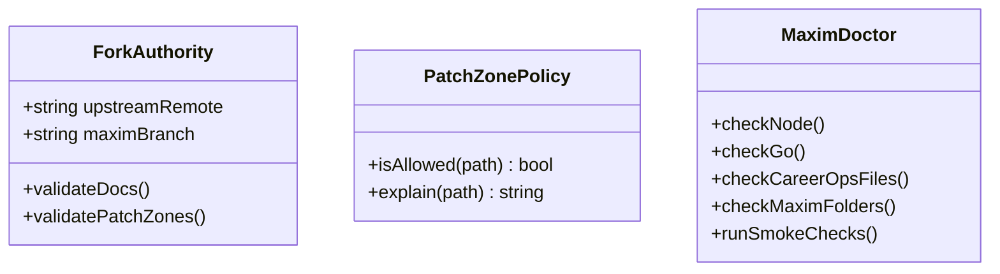

### Files and Functions

| File | Purpose | Key Functions |
|---|---|---|
| `MAXIM_APPLY.md` | Project identity and rules. | N/A |
| `docs/maxim/adr/0001-career-ops-fork-authority.md` | Authority stack. | N/A |
| `maxim/scripts/doctor-maxim.mjs` | Setup validation. | `runDoctor`, `checkPatchZones`, `checkNativeCommands` |
| `maxim/lib/patch-zone-policy.mjs` | Fork boundary rules. | `isAllowedPath`, `explainBoundary` |

### Acceptance Criteria

- Native Career-Ops dashboard builds.
- Maxim skeleton exists but does not alter core behavior.
- Codex/Copilot instructions clearly forbid LinkedIn sending and auto-submit in v1.
- Patch zones are documented.

## 10. Feature 1 - Xavier User-Layer Configuration

### Purpose

Configure Career-Ops to understand Xavier's approved positioning, role lanes, preferences, and claim boundaries without modifying upstream system logic.

### Requirements

| ID | Requirement |
|---|---|
| F1-001 | Create or update `cv.md` from approved resume content. |
| F1-002 | Create `config/profile.yml` with NoVA/DC, salary, clearance, and role-lane configuration. |
| F1-003 | Create `modes/_profile.md` with Xavier narrative, archetypes, and caution categories. |
| F1-004 | Never claim active clearance. |
| F1-005 | Phrase AWS modestly unless evidence is explicitly approved. |
| F1-006 | Keep Wabtec internal details non-public and non-distributable. |

### Low-Level Model

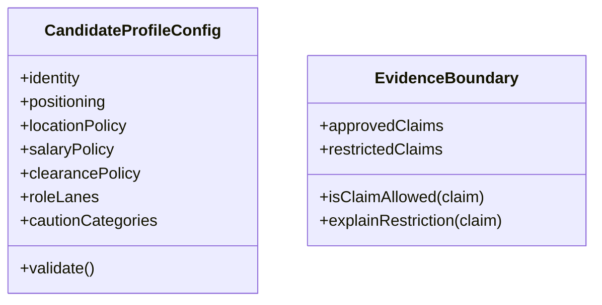

### Acceptance Criteria

- A sample Career-Ops evaluation uses Xavier's approved positioning.
- No generated content claims active clearance.
- AWS wording is not overstated.
- Profile files are in Career-Ops user layer.

## 11. Feature 2 - Maxim Store and Event Log

### Purpose

Provide structured local state for Maxim extensions without replacing Career-Ops tracker or reports.

### Requirements

| ID | Requirement |
|---|---|
| F2-001 | Create SQLite store at `data/maxim/maxim.db`. |
| F2-002 | Create append-only JSONL event log under `data/maxim/events/`. |
| F2-003 | Implement store and event interfaces before feature logic. |
| F2-004 | Keep SQLite behind `MaximStore`. |
| F2-005 | Add migrations and tests. |

### Minimum Schema

```sql
career_ops_evaluations(id, report_path, pdf_path, company, role, score, source, created_at, updated_at)
maxim_jobs(id, evaluation_id, tier, status, next_action, created_at, updated_at)
priority_flags(id, job_id, flag_type, severity, reason, created_at)
contacts(id, name, company, title, linkedin_url, email, connection_strength, source, notes)
networking_targets(id, job_id, contact_id, rank_score, ranking_reason, status)
message_drafts(id, target_id, channel, draft_text, cta, status, created_at, updated_at)
applications(id, job_id, career_ops_row_key, status, applied_at, score, tier, source, pdf_path, report_path)
recruiter_threads(id, source, subject, company, status, needs_response, last_activity_at)
metric_snapshots(id, period_start, period_end, primary_kpi, payload_json)
user_decisions(id, entity_type, entity_id, decision_type, reason, created_at)
```

### Low-Level Model

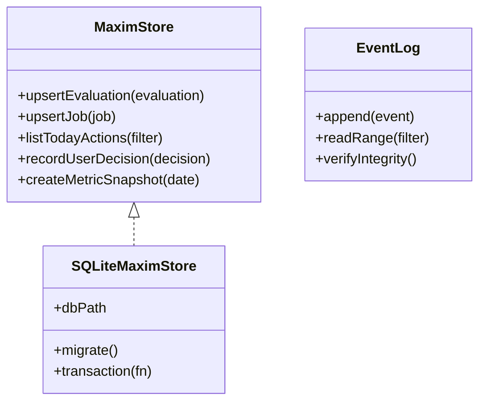

### Acceptance Criteria

- Store initializes on a fresh repo.
- Migrations are idempotent.
- Events append without mutating old entries.
- Tests use temporary DBs.

## 12. Feature 3 - Career-Ops Sync Adapter

### Purpose

Parse Career-Ops artifacts into Maxim records without making the dashboard parse raw files.

### Requirements

| ID | Requirement |
|---|---|
| F3-001 | Parse `reports/*.md` for company, role, score, source, summary, and links when available. |
| F3-002 | Parse/link generated PDFs from `output/`. |
| F3-003 | Parse `data/applications.md` without corrupting it. |
| F3-004 | Tolerate report format changes. Do not depend on exact A-F/A-G headings. |
| F3-005 | Upsert idempotently. |
| F3-006 | Emit `CAREEROPS_SYNCED` events. |

### Low-Level Model

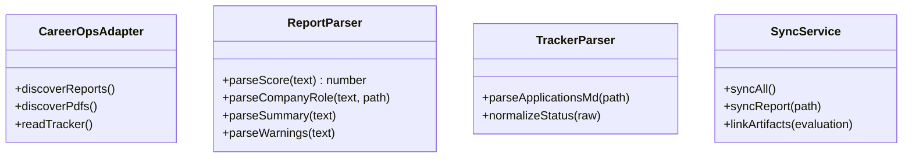

### Acceptance Criteria

- Fixture reports parse into CareerOpsEvaluation records.
- Parser failure creates an import issue, not a crash.
- Native Career-Ops files are not modified.

## 13. Feature 4 - Score-to-Tier Router and Priority Flags

### Purpose

Convert Career-Ops score into Maxim tier and attach workflow flags.

### Requirements

| ID | Requirement |
|---|---|
| F4-001 | Score below 3.5 maps to T0. |
| F4-002 | Score 3.5-3.9 maps to T1. |
| F4-003 | Score 4.0-4.4 maps to T2. |
| F4-004 | Score 4.5+ maps to T3. |
| F4-005 | Connection Priority Overlay does not change fit score. |
| F4-006 | Apply NoVA/DC, salary, clearance, freshness, source, and caution flags. |
| F4-007 | Fresh T2+ roles posted within 2 days create urgent action. |
| F4-008 | Every tier/flag has a reason. |

### Low-Level Model

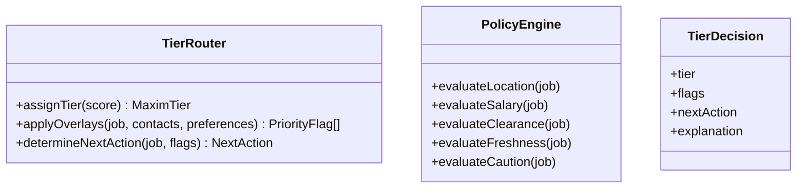

### Acceptance Criteria

- Threshold tests pass at 3.49, 3.5, 3.99, 4.0, 4.49, 4.5.
- Maryland is excluded by default.
- Manassas and Gainesville count as NoVA.
- Active-clearance-only roles get caution/reject behavior unless sponsorship language exists.

## 14. Feature 5 - Integrated Dashboard Mode

### Purpose

Extend the existing Career-Ops dashboard with a Maxim Apply command-center mode.

### Requirements

| ID | Requirement |
|---|---|
| F5-001 | Preserve all native Career-Ops dashboard behavior. |
| F5-002 | Add mode/toggle/keybinding for Maxim Apply. |
| F5-003 | Use `DashboardService` DTOs; screens do not query SQLite directly. |
| F5-004 | Implement Today and High Conviction screens first. |
| F5-005 | Add Networking, Recruiter, Applications, Analytics, and Settings incrementally. |
| F5-006 | A failing Maxim screen must not block native dashboard startup. |

### Dashboard Model

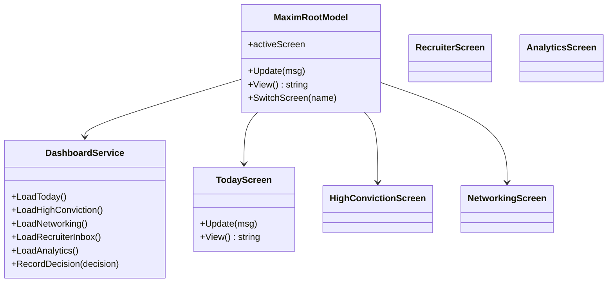

### Acceptance Criteria

- Existing dashboard builds and runs.
- Maxim mode opens and exits cleanly.
- Empty state is useful on first run.
- Today screen shows urgent fresh T2+ roles and routine batches separately.

## 15. Feature 6 - Historical Tracker Import

### Purpose

Import the Google Sheets history as raw data and normalized records for analytics.

### Requirements

| ID | Requirement |
|---|---|
| F6-001 | Preserve raw spreadsheet exactly under `data/maxim/imports/raw/`. |
| F6-002 | Preserve raw fields: Company Name, Application Status, Source, Link, CV, Role, Salary, Date Submitted, Interview Round, Rejection Reason. |
| F6-003 | Treat Interview Round as high-trust interview signal. |
| F6-004 | Treat Application Status as soft unless it confirms interview. |
| F6-005 | Normalize separately and emit import issues. |
| F6-006 | Do not use history to auto-change scoring until approved. |

### Low-Level Model

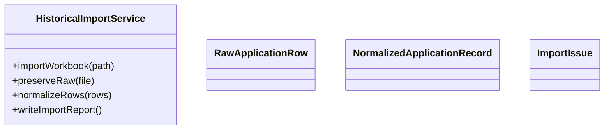

### Acceptance Criteria

- Import can be rerun idempotently.
- Raw copy is unchanged.
- Interview conversion can be computed from Interview Round fields.

## 16. Feature 7 - Networking Shortlist and Message Queue

### Purpose

Help Xavier perform high-leverage manual LinkedIn/networking outreach without bot sending.

### Requirements

| ID | Requirement |
|---|---|
| F7-001 | Generate shortlist for T2/T3/connection-priority jobs. |
| F7-002 | Rank by existing connection, strength 1-3, VT alumni, recruiter/hiring relevance, seniority, founder status, and role relevance. |
| F7-003 | Generate ranking explanations. |
| F7-004 | Create message drafts following five-part structure. |
| F7-005 | Mark drafts Ready to Send, Sent Manually, Replied, Follow-Up Due, Referral Asked, Referred, Declined, No Response. |
| F7-006 | No function sends LinkedIn messages. |

### Low-Level Model

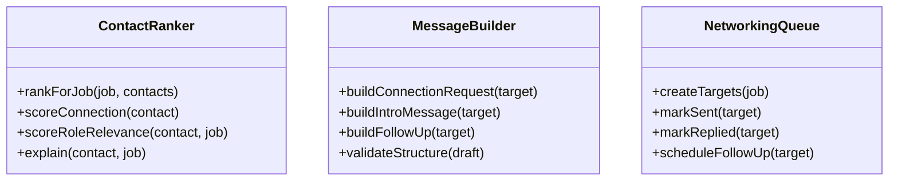

### Message Structure

```text
1. Research the person.
2. The role.
3. Xavier's information.
4. Why Xavier is a good fit.
5. Call to action.
```

### Acceptance Criteria

- Dashboard shows ranked people and draft preview.
- Draft can be marked as sent manually.
- Safety test proves no LinkedIn send implementation exists.

## 17. Feature 8 - Discord Notifications and Batching

### Purpose

Keep Xavier accountable without creating constant interruptions.

### Requirements

| ID | Requirement |
|---|---|
| F8-001 | Discord is primary notification channel. |
| F8-002 | Fresh T2+ roles posted within 48 hours alert immediately. |
| F8-003 | Routine resume/message/review items are batched at configured times. |
| F8-004 | Recruiter Needs Response alerts can escalate by freshness. |
| F8-005 | Notifications are deduped and auditable. |

### Low-Level Model

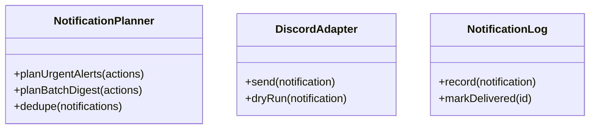

### Acceptance Criteria

- Dry-run works without Discord token.
- Urgent and batched messages are distinct.
- Notification history appears in dashboard.

## 18. Feature 9 - Recruiter Inbox Tracking

### Purpose

Prevent missed recruiter or scheduling opportunities.

### Requirements

| ID | Requirement |
|---|---|
| F9-001 | Track recruiter threads manually in v1. |
| F9-002 | Support tags: Recruiter DM, Needs Response, Responded, Follow-Up Due, Interview Scheduling. |
| F9-003 | Auto-clear Needs Response when reply is recorded. |
| F9-004 | Allow dashboard correction of wrong tags. |
| F9-005 | Personal email actions can be logged manually. |
| F9-006 | Gmail integration remains optional later. |

### Low-Level Model

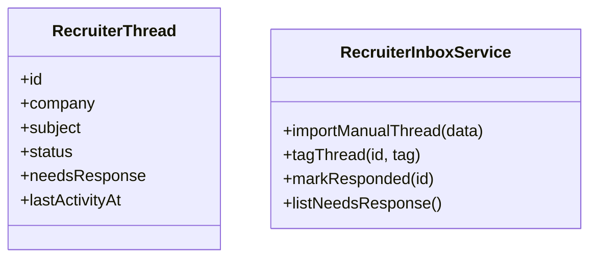

### Acceptance Criteria

- Needs Response items show in Today view.
- False tags can be corrected.
- Marking responded clears Needs Response.

## 19. Feature 10 - Analytics and Weekly Review

### Purpose

Optimize the system around interview rate percentage for NoVA/DC-compatible roles.

### Requirements

| ID | Requirement |
|---|---|
| F10-001 | Primary KPI is interview rate %. |
| F10-002 | Break down by score band, tier, source, role lane, PDF/resume, networking status, connection strength, freshness, company type, and recruiter involvement. |
| F10-003 | Show small-sample warnings. |
| F10-004 | Produce weekly recommendations. |
| F10-005 | Do not auto-adjust scoring without user approval. |

### Low-Level Model

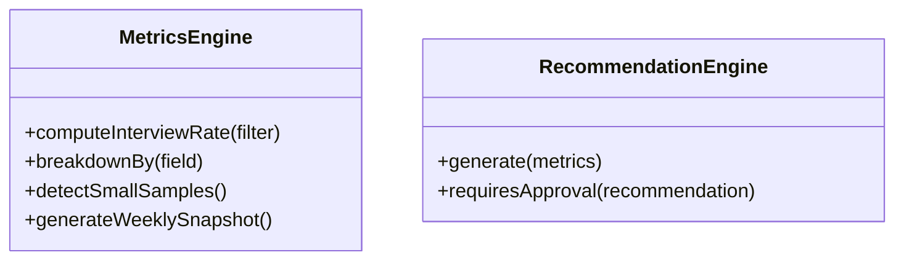

### Acceptance Criteria

- Analytics screen shows primary KPI and breakdowns.
- Recommendations distinguish signal from small samples.
- User approval is required before scoring/routing changes.

## 20. Feature 11 - Assisted Application Workflow

### Purpose

Integrate Career-Ops apply assistant into Maxim action queues.

### Requirements

| ID | Requirement |
|---|---|
| F11-001 | Dashboard shows packet status: Report Ready, PDF Ready, Apply Assistant Needed, Submitted, Outcome Needed. |
| F11-002 | User can open or invoke Career-Ops apply workflow from a job detail. |
| F11-003 | Application status links back to score, tier, report, PDF, source, and networking state. |
| F11-004 | No auto-submit in v1. |
| F11-005 | Future executor requires separate approved design. |

### State Model

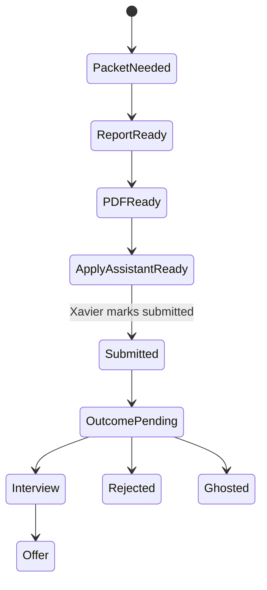

### Acceptance Criteria

- Dashboard clearly shows what is ready and what Xavier must do.
- Application submitted status is manually recordable.
- No automated submit path exists.

## 21. Feature 12 - Website Safety and Platform Behavior Tests

### Purpose

Prevent scope creep into unsafe or hidden automation.

### Requirements

| ID | Requirement |
|---|---|
| F12-001 | CI/test suite fails if LinkedIn send automation exists. |
| F12-002 | CI/test suite fails if v1 auto-submit code path exists. |
| F12-003 | Tests detect uncontrolled retries, high-frequency requests, or missing rate limits in website-facing scripts. |
| F12-004 | Tests confirm dry-run modes for notifications and website checks. |
| F12-005 | Native Career-Ops scan behavior is not weakened. |

### Acceptance Criteria

- Safety tests are part of release gate.
- Tests are written as guardrails, not as anti-bot bypass tools.
- The suite focuses on human-scale pacing, stop conditions, and absence of prohibited actions.

# Part 4 - Sequence Diagrams and State Models

## 22. Sequence - Scan, Evaluate, Sync, Tier, Display

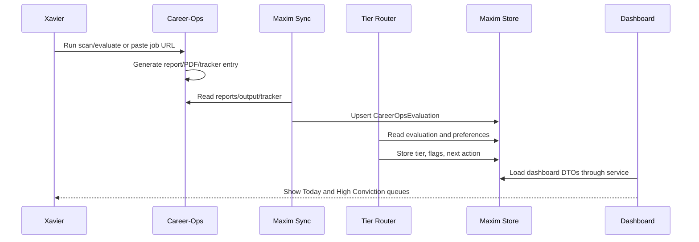

## 23. Sequence - Networking Shortlist

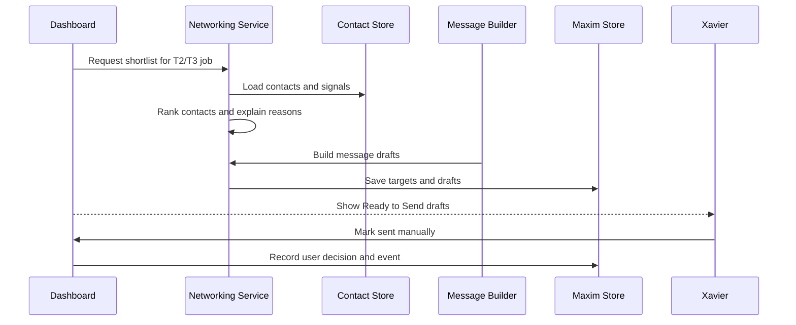

## 24. Sequence - Recruiter Needs Response

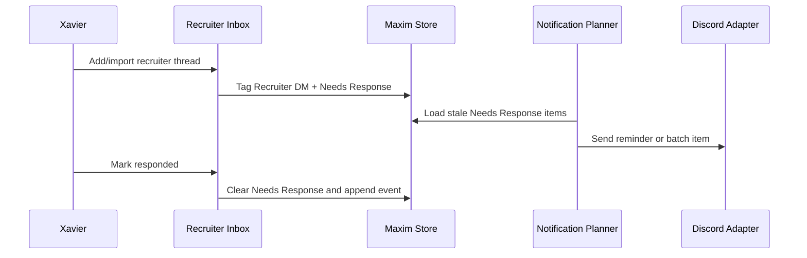

## 25. State - Maxim Job

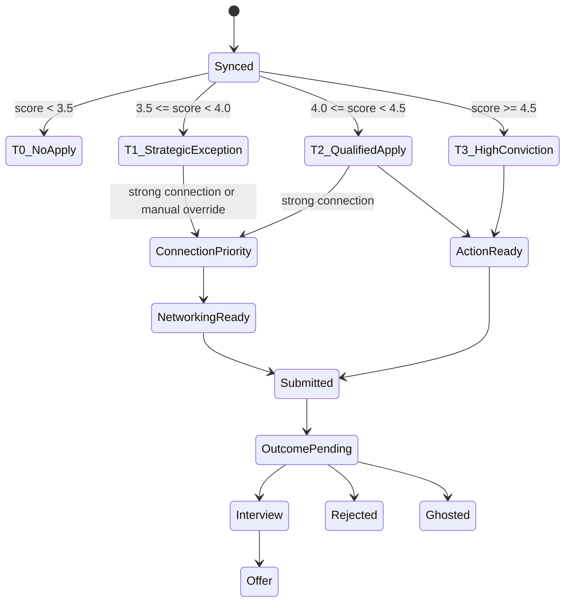

## 26. State - Message Draft

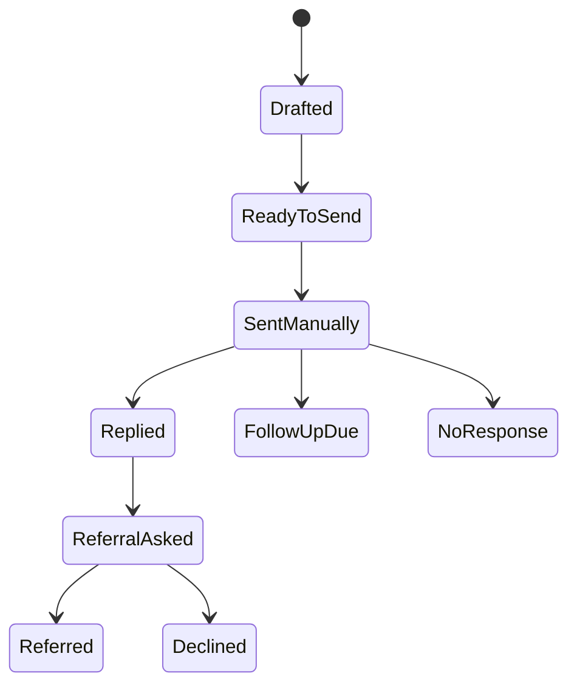

# Part 5 - Testing, Risk, Phases, and Copilot/Codex Backlog

## 27. Test Strategy

| Test Type | Purpose | Examples |
|---|---|---|
| Native smoke tests | Prove Career-Ops still works. | dashboard build, scan script exists, tracker parse. |
| Unit tests | Test small modules. | tier thresholds, policy flags, parser helpers, message structure. |
| Integration tests | Test flows across modules. | sync -> tier -> store -> dashboard DTO. |
| Fixture tests | Protect against format drift. | sample reports, sample tracker, sample historical XLSX. |
| Dashboard tests | Protect TUI behavior. | mode switch, screen states, data loading errors. |
| Safety tests | Prevent prohibited behavior. | no LinkedIn send, no auto-submit, no uncontrolled retries. |
| Windows smoke tests | Match Xavier's environment. | setup, dashboard, scripts, paths, Docker if used. |
| Upstream merge tests | Reduce fork drift risk. | patch zone report, native features still pass. |

## 28. Risk Register

| Risk | Severity | Mitigation |
|---|---:|---|
| Native dashboard breaks | High | Minimal hook, dashboard smoke tests, Maxim screens isolated. |
| Upstream changes conflict | High | Patch zones, ADRs, rebase checklist, small upstream-touching diff. |
| Report parser breaks | Medium | Tolerant parser, fixtures, fallback to tracker where possible. |
| SQLite schema leaks into UI | Medium | Dashboard DTO and service interface. |
| Event log omitted | Medium | Event append is acceptance criterion for meaningful actions. |
| Too much notification noise | Medium | Batch routine items, urgent only for fresh T2+ and response-critical items. |
| LinkedIn automation creep | High | No send code, safety tests, dashboard manual-send status only. |
| Auto-submit returns too early | High | Explicit future gate; no v1 code path. |
| Historical data overfitting | Medium | Small-sample warnings and no automatic scoring changes. |
| Personal data mishandled | High | User-layer rules, raw preservation, no Wabtec internal public distribution. |

## 29. Implementation Phases

## Phase 0 - Fork and Baseline Authority

Goal: create the safe fork foundation.

Deliverables:

- Fork with upstream remote preserved.
- Maxim authority docs and ADRs.
- Patch boundary policy.
- `maxim/` and `dashboard/internal/maxim/` skeleton.
- Native Career-Ops build/test smoke checks.

Exit Criteria:

- Native Career-Ops dashboard builds.
- Maxim has no functional behavior yet but has safe boundaries.

## Phase 1 - Xavier Configuration and Evaluation Smoke Test

Goal: configure Career-Ops for Xavier without modifying upstream system files unnecessarily.

Deliverables:

- `cv.md`.
- `config/profile.yml`.
- `modes/_profile.md`.
- Xavier role lanes and caution categories.
- Sample JD evaluation.

Exit Criteria:

- Career-Ops produces a score/report that reflects Xavier's positioning.
- No active-clearance or unsupported AWS overclaim appears.

## Phase 2 - Store, Event Log, and Sync Adapter

Goal: give Maxim a structured, auditable extension state.

Deliverables:

- SQLite schema/migrations.
- JSONL event log.
- Report/tracker/PDF parser fixtures.
- `maxim-sync` script.

Exit Criteria:

- Career-Ops reports sync into SQLite.
- Sync appends events.
- Native Career-Ops files are unchanged.

## Phase 3 - Tier Router and Policy Flags

Goal: route Career-Ops evaluations into Maxim workflows.

Deliverables:

- Score-to-tier mapping.
- NoVA/DC, salary, clearance, freshness, caution, source, connection flags.
- Unit tests.

Exit Criteria:

- Tiers and flags are explainable.
- Fresh T2+ urgent actions can be generated.

## Phase 4 - Dashboard Integration MVP

Goal: add the integrated Maxim mode.

Deliverables:

- Dashboard mode toggle.
- Dashboard service adapter.
- Today screen.
- High Conviction screen.
- Error/empty states.

Exit Criteria:

- User can view Maxim actions inside Career-Ops dashboard.
- Native Career-Ops dashboard remains usable.

## Phase 5 - Historical Tracker Import

Goal: preserve and normalize prior application history.

Deliverables:

- XLSX import.
- Raw preservation.
- Normalization and import issues.
- Import report.
- Dashboard summary.

Exit Criteria:

- Historical records are available for analytics without overwriting raw data.

## Phase 6 - Networking Shortlist and Message Queue

Goal: make manual LinkedIn networking fast and high quality.

Deliverables:

- Contact import.
- Contact ranking.
- Message drafts.
- Networking dashboard.
- Manual-send status tracking.

Exit Criteria:

- T2/T3 jobs produce ranked targets and ready-to-send drafts.
- No LinkedIn sending exists.

## Phase 7 - Discord Notifications

Goal: keep Xavier focused on urgent and batched actions.

Deliverables:

- Notification planner.
- Discord dry-run and live adapter.
- Urgent fresh T2+ alerts.
- Batch digest.
- Notification history.

Exit Criteria:

- Discord messages are useful, deduped, and auditable.

## Phase 8 - Recruiter Inbox

Goal: prevent missed recruiter conversations.

Deliverables:

- Recruiter thread model.
- Needs Response workflow.
- Dashboard screen.
- Manual correction.
- Optional future Gmail adapter stub.

Exit Criteria:

- User can track recruiter DMs and response commitments.

## Phase 9 - Analytics and Weekly Review

Goal: optimize around interview rate percentage.

Deliverables:

- Metrics engine.
- Analytics dashboard.
- Weekly snapshot.
- Small-sample warnings.
- Recommendation generator.

Exit Criteria:

- Dashboard shows interview-rate percentage and useful breakdowns.

## Phase 10 - Hardening and Release Candidate

Goal: make the fork stable for daily use.

Deliverables:

- Full tests.
- Website safety suite.
- Windows smoke test.
- Upstream merge checklist.
- Setup guide.
- Known limitations.

Exit Criteria:

- Xavier can use Maxim Apply daily without developer intervention.

## Phase 11 - Future Executor Assessment

Goal: decide whether auto-submit is still worth building.

Do not begin until:

- Career-Ops assisted workflow is used regularly.
- Dashboard and networking flows work.
- Analytics show manual submission is still the primary bottleneck.
- A separate executor design is approved.

## 30. Copilot/Codex Backlog

### Task 0.1 - Read and summarize authority

```text
Read MAXIM_APPLY.md, docs/maxim/architecture/project-description-v2.1.md, docs/maxim/architecture/implementation-roadmap-v1.1.md, Career-Ops AGENTS.md, and DATA_CONTRACT.md. Create docs/maxim/phase-0-plan.md summarizing preserved behavior, extension zones, prohibited behavior, and first five implementation tasks. Do not write feature code yet.
```

### Task 0.2 - Add fork authority docs

```text
Add Maxim ADRs and AGENTS.md addendum. Include no LinkedIn sending, no auto-submit in v1, user-layer data rules, patch boundaries, and native Career-Ops preservation. Run native smoke checks.
```

### Task 1.1 - Create Xavier profile configuration

```text
Create cv.md, config/profile.yml, and modes/_profile.md from approved source material. Do not invent claims. Do not claim active clearance. Keep AWS phrasing modest. Add a sample JD evaluation fixture.
```

### Task 2.1 - Implement Maxim store and event log

```text
Implement schema, migrations, SQLiteMaximStore, and EventLog. Add unit tests using temporary data directories. Do not read or modify Career-Ops tracker yet.
```

### Task 2.2 - Implement Career-Ops sync adapter

```text
Parse reports, PDFs, and applications.md into Maxim records. Use fixtures. Upsert idempotently. Tolerate report format changes. Append sync events.
```

### Task 3.1 - Implement tier router and policy flags

```text
Implement score-to-tier mapping and flags for NoVA/DC, salary, clearance, freshness, source, caution, and connection overlay. Add threshold tests and explanation tests.
```

### Task 4.1 - Add dashboard mode seam

```text
Add minimal Maxim mode toggle to Career-Ops dashboard. Implement MaximRootModel and DashboardService with mock data first. Preserve native dashboard behavior.
```

### Task 4.2 - Connect dashboard to store

```text
Connect Today and High Conviction screens to MaximStore through DashboardService DTOs. Add error and empty states.
```

### Task 5.1 - Import historical tracker

```text
Implement XLSX import with raw preservation, normalization, import issues, and import report. Treat Interview Round as high-trust and Application Status as soft.
```

### Task 6.1 - Build contact ranker

```text
Implement contact import and ranking with connection strength 1-3, VT alumni, recruiter/hiring relevance, role relevance, founder/startup signals, and ranking explanations.
```

### Task 6.2 - Build message draft queue

```text
Generate LinkedIn/email drafts using the five-part structure. Store drafts as Ready to Send. No send function is allowed.
```

### Task 7.1 - Add Discord notifications

```text
Implement notification planner, dry-run Discord adapter, urgent fresh T2+ alerts, batch digest, and notification history.
```

### Task 8.1 - Add recruiter inbox

```text
Implement recruiter thread model, Needs Response tags, manual correction, mark responded, and dashboard screen.
```

### Task 9.1 - Add analytics

```text
Implement interview rate percentage, breakdowns, small-sample warnings, and weekly snapshot. Do not auto-change scoring.
```

### Task 10.1 - Release hardening

```text
Run native Career-Ops smoke tests, Maxim tests, website safety tests, dashboard build, Windows checks, and upstream merge checklist. Produce release notes and known limitations.
```

## 31. Definition of Done

Maxim Apply v1.1 implementation is done when:

- Career-Ops remains usable as Career-Ops.
- Maxim mode is integrated into Career-Ops dashboard.
- Career-Ops scores map to Maxim tiers.
- T2/T3/fresh/connection-priority jobs show clear next actions.
- Xavier's NoVA/DC, salary, clearance, role-lane, and source policies are represented.
- Historical tracker import preserves raw data and produces normalized analysis fields.
- Networking shortlist produces ranked people and ready-to-send messages without sending LinkedIn messages.
- Discord sends urgent and batched alerts.
- Recruiter Needs Response tracking exists.
- Analytics show interview rate percentage and key breakdowns.
- Append-only event log records meaningful actions.
- Safety tests prevent LinkedIn bot sending, anti-bot evasion, uncontrolled retries, and v1 auto-submit.
- Documentation explains setup, usage, upstream merge strategy, patch boundaries, and limitations.

## 32. Explicit Non-Scope for v1

- No full autonomous application submitter.
- No separate web CRM dashboard.
- No replacement of Career-Ops scoring.
- No replacement of Career-Ops PDF generation.
- No replacement of Career-Ops scanner.
- No LinkedIn message sending by automation.
- No cloud-hosted backend.
- No automatic scoring changes from small samples.
- No public distribution of Wabtec internal materials.

# Appendix A - Requirements Traceability

| v2.1 Requirement | Roadmap Feature/Phase |
|---|---|
| Career-Ops fork | Feature 0, Phase 0 |
| Preserve core engine | Features 0-3, all phases |
| Integrated dashboard | Feature 5, Phase 4 |
| Score-driven tiering | Feature 4, Phase 3 |
| Priority overlays | Feature 4, Phase 3 |
| NoVA/DC mission | Feature 1, Feature 4 |
| Evidence safety | Feature 1, Feature 11 |
| Manual LinkedIn sending | Feature 7, Feature 12 |
| Historical import | Feature 6, Phase 5 |
| Recruiter tracking | Feature 9, Phase 8 |
| Discord accountability | Feature 8, Phase 7 |
| Interview-rate KPI | Feature 10, Phase 9 |
| Append-only audit events | Feature 2 |
| Upstream compatibility | Feature 0, Patch Boundary Rules |
| Dashboard DTO/service boundary | Feature 5 |
| Future executor gate | Phase 11 |

# Appendix B - Architecture Consultant Alignment

| Consultant Principle | Roadmap Response |
|---|---|
| Primitive identification | Part 2 defines primitives and owners. |
| Black-box boundaries | Module interface tables and service interfaces define boundaries. |
| Dependency architecture | Career-Ops, SQLite, Discord, Gmail, LinkedIn research, and filesystem are wrapped. |
| Format design thinking | YAML, Markdown, SQLite, JSONL, and DTOs each have a defined purpose. |
| Foundation first | Phases 0-4 establish authority, config, store, sync, tier, and dashboard seam before advanced workflows. |
| Replaceability | `MaximStore`, `DashboardService`, adapters, and parser interfaces isolate changes. |
| Risk isolation | Safety tests and non-scope rules prevent LinkedIn sending and auto-submit creep. |
| Team scalability | Modules are small enough for one developer each. |

# Appendix C - Initial Configuration Values

```yaml
location:
  allowed_primary:
    - Northern Virginia
    - Washington, DC
    - Arlington
    - Alexandria
    - Fairfax
    - Reston
    - Herndon
    - Chantilly
    - Tysons
    - McLean
    - Ashburn
    - Manassas
    - Gainesville
  excluded_by_default:
    - Maryland
  remote_rule: allow_only_if_strong_fit

salary:
  global_minimum: 85000
  t3_flat_minimum: 90000
  range_minimum_floor: 80000
  range_maximum_required: 95000
  expected_salary_default: 100000
  expected_salary_high_fit: 110000
  text_answer: "Negotiable based on role scope and total compensation."

clearance:
  us_citizen: true
  active_clearance: false
  ever_held_clearance: false
  willing_to_obtain: true
  public_trust_willing: true
  secret_ts_sci_willing: true

networking:
  linkedin_auto_send: false
  prioritize_vt_alumni: true
  message_structure:
    - person_research
    - role
    - xavier_information
    - fit_rationale
    - call_to_action

notifications:
  channel: discord
  urgent_freshness_hours: 48
  review_sla_hours: 12
  batch_routine_items: true
  resume_variant_review_cadence_days: 21
```
